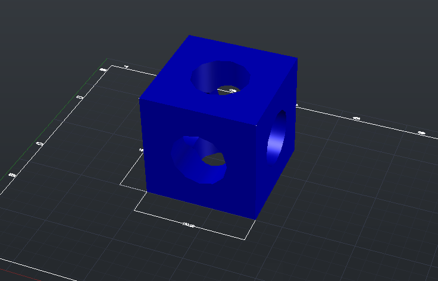

# 📐 AutoCAD Mecánico - Prácticas de Ingeniería

Repositorio de prácticas de AutoCAD realizado durante mi formación en Ingeniería Mecánica.

El objetivo de este proyecto es desarrollar habilidades de dibujo técnico, modelado 3D y elaboración de planos mecánicos siguiendo normas ISO/IRAM.

---

# Progreso

| Estado | Pieza |
|---------|-------|
| ✅ | Cubo |
| ⬜ | Prisma rectangular |
| ⬜ | Placa con agujeros |
| ⬜ | Arandela |
| ⬜ | Casquillo |
| ⬜ | Cilindro |
| ⬜ | Eje liso |
| ⬜ | Eje escalonado |
| ⬜ | Chaveta |
| ⬜ | Buje con chavetero |
| ⬜ | Brida |
| ⬜ | Acople rígido |
| ⬜ | Polea |
| ⬜ | Tornillo hexagonal |
| ⬜ | Tuerca |
| ⬜ | Perno + Arandela + Tuerca |
| ⬜ | Soporte de rodamiento |
| ⬜ | Rodamiento |
| ⬜ | Biela |
| ⬜ | Manivela |
| ⬜ | Cigüeñal |
| ⬜ | Engranaje recto |
| ⬜ | Engranaje helicoidal |
| ⬜ | Engranaje cónico |
| ⬜ | Tornillo sin fin |
| ⬜ | Caja reductora |
| ⬜ | Prensa tipo C |
| ⬜ | Morsa |
| ⬜ | Gato mecánico |
| ⬜ | Proyecto Final |

---

# 01 - Cubo

## Objetivo

Aprender:

- Configuración del plano
- Capas (Layers)
- Acotado
- Rótulo
- Layout
- Impresión

### Plano

---

# 02 - Prisma rectangular

## Objetivo

- Vistas ortogonales
- Acotado

### Plano

---

# 03 - Placa con agujeros

## Objetivo

- Círculos
- Posicionamiento
- Acotado

### Plano

---

# 04 - Arandela

## Objetivo

- Círculos concéntricos

### Plano

---

# 05 - Casquillo

## Objetivo

- Diámetros
- Cortes

### Plano

---

# 06 - Cilindro

## Objetivo

- Extrude
- Revolve

### Plano

---

# 07 - Eje liso

### Plano

---

# 08 - Eje escalonado

### Plano

---

# 09 - Chaveta

### Plano

---

# 10 - Buje con chavetero

### Plano

---

# 11 - Brida

### Plano

---

# 12 - Acople rígido

### Plano

---

# 13 - Polea

### Plano

---

# 14 - Tornillo hexagonal

### Plano

---

# 15 - Tuerca

### Plano

---

# 16 - Perno + Arandela + Tuerca

### Plano

---

# 17 - Soporte de rodamiento

### Plano

---

# 18 - Rodamiento

### Plano

---

# 19 - Biela

### Plano

---

# 20 - Manivela

### Plano

---

# 21 - Cigüeñal

### Plano

---

# 22 - Engranaje recto

### Plano

---

# 23 - Engranaje helicoidal

### Plano

---

# 24 - Engranaje cónico

### Plano

---

# 25 - Tornillo sin fin

### Plano

---

# 26 - Caja reductora

### Plano

---

# 27 - Prensa tipo C

### Plano

---

# 28 - Morsa

### Plano

---

# 29 - Gato mecánico

### Plano

---

# 30 - Proyecto Final

## Objetivo

Diseñar un conjunto mecánico completo utilizando todas las herramientas aprendidas durante las prácticas.

### Plano

---

# Herramientas utilizadas

- AutoCAD 2016
- Normas ISO / IRAM
- Git
- GitHub

---

# Autor

**Diego Maneyro**

Estudiante de Ingeniería Mecánica
